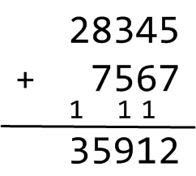
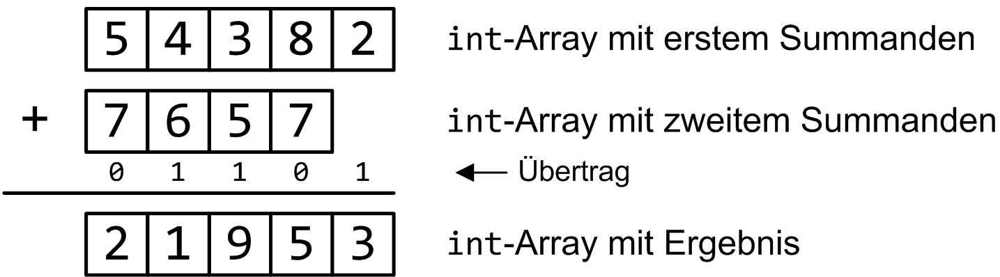
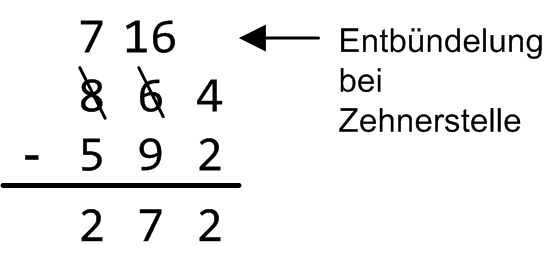
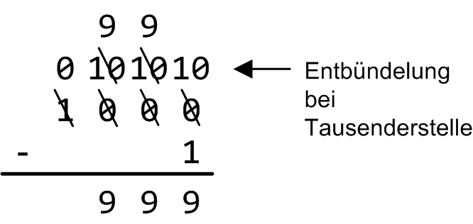
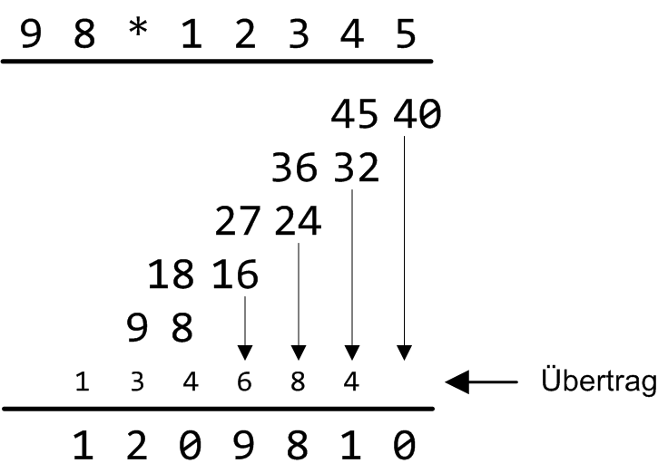
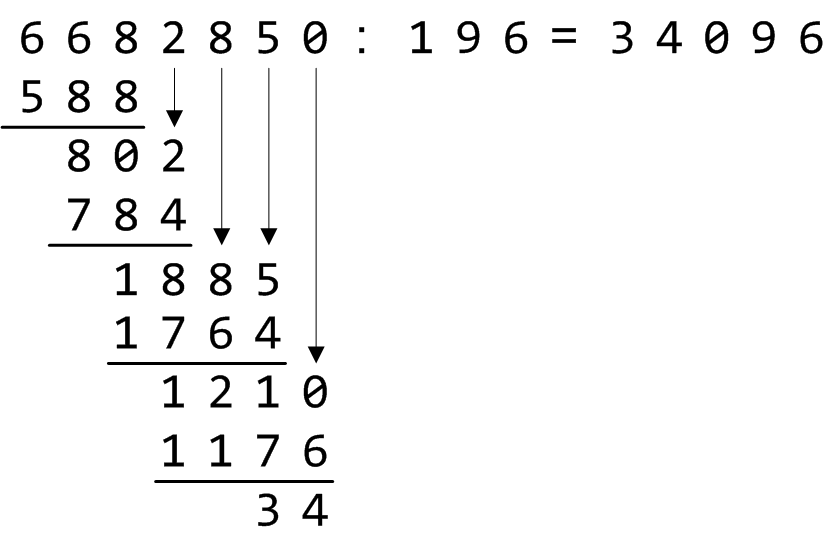
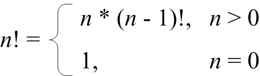

# Klasse `BigInteger`

Der ganzzahlige Standarddatentyp ``int`` in Dart besitzt die Eigenschaft, dass sein Wertebereich limitiert ist. Für viele Anwendungen ist dies nicht nachteilig, da sich speziell mit den Datentypen ``int`` (oder auch ``num``) ziemlich große Zahlen darstellen lassen. Für manche Anwendungen ist die Verarbeitung von ganzen Zahlen beliebiger Größe jedoch unabdingbar. Wir stellen im Folgenden eine Klasse ``BigInteger`` vor, die eine exakte Arithmetik vorzeichenbehafteter ganzer Zahlen beliebiger Größe zur Verfügung stellt.

Um potentiell beliebig viele Ziffern einer sehr großen Zahl in einem BigInteger-Objekt abzulegen, gibt es mehrere Möglichkeiten wie etwa die Verwendung (generischer) Standardcontainer (Klasse ``List<int>``) oder auch einfach auch nur die Ablage der Ziffern in einer Zeichenkette (Klasse ``String``). In der vorgestellten Lösung zu dieser Aufgabe legen wir ein Array in der Variante *growable* List - also keine *fixed-length* List - zu Grunde.

## Grundgerüst der Klasse `BigInteger`

Unsere Kenntnisse aus der Schulmathematik zur schriftlichen Addition, Multiplikation usw. stellen die Grundlage für die Implementierung der arithmetischen Operatoren in der ``BigInteger``-Klasse dar. Vermutlich sind Ihre Erinnerungen hierzu, wie meine auch, zwischenzeitlich recht verschwommen. In den nachfolgenden Hinweisen finden Sie einen kurzen Auffrischungskurs dieser schulmathematischen Grundlagen vor. Damit kein Missverständnis entsteht: Zum Rechnen mit einzelnen Ziffern der sehr großen Zahlen dürfen Sie die Standardoperatoren von Dart wie ``+`` oder ``*`` natürlich verwenden. In der Klasse ``BigInteger`` sind diese neu zu implementieren, eben um auch mit sehr großen Zahlen exakt arithmetisch rechnen zu können.

Erste Hinweise zur ``BigInteger``-Klasse (Konstruktoren) finden Sie in Tabelle 1 vor:

| Konstruktor | Schnittstelle und Beschreibung |
|:-------------- |-----|
| ``BigInteger.zero`` | ``BigInteger.zero();``<br/> Erzeugt ein ``BigInteger``-Objekt mit dem Wert 0. |
| ``BigInteger`` | ``BigInteger(String s);``<br/> Erzeugt ein ``BigInteger``-Objekt mit Hilfe der Beschreibung einer Zahl in Form einer Zeichenkette. Die Zeichenkette darf optional mit einem Plus- oder Minuszeichen beginnen, um das Vorzeichen der Zahl festzulegen. Danach folgen beliebig viele dezimale Ziffern: <br/> ``BigInteger a ("+11111111111111111111111111111111111111");`` <br/> Mit Ausnahme von Punkten dürfen in der Zeichenkette keine anderen Zeichen enthalten sein. Punkte sind der besseren Lesbarkeit halber in der Zeichenkette zulässig, wie etwa ``"123.456.789"``.|
| ``BigInteger.fromInt`` | ``BigInteger.fromInt(int n);``<br/> Erzeugt ein ``BigInteger``-Objekt zu einem ``int``-Wert ``n``. |
| ``BigInteger.clone`` | ``BigInteger.clone(BigInteger number);``<br/> Erzeugt eine Kopie eines  ``BigInteger``-Objekts - siehe Parameter ``number``. |

Tabelle 1. Konstruktoren der Klasse ``BigInteger``.

Das Vorzeichen, die Anzahl der Ziffern und das Prädikat IsNull werden in der Klasse ``BigInteger`` durch *getter*-Methoden realisiert (Tabelle 2):

| getter | Schnittstelle und Beschreibung |
|:-------------- |---|
| ``Sign``   | ``bool get Sign``<br/> Liefert das Vorzeichen der Zahl zurück, ``true`` entspricht einer positiven Zahl, ``false`` einer negativen. |
| ``Cardinality``   | ``int get Cardinality``<br/> Liefert die Anzahl der Ziffern der Zahl zurück, auch *Stelligkeit* der ganzen Zahl genannt. |
| ``IsNull``   | ``bool get IsNull``<br/> Liefert ``true`` zurück, wenn die Zahl den Wert 0 besitzt, andernfalls ``false``. |

Tabelle 2. *getter*-Methoden der Klasse ``BigInteger``.

## Arithmetische Operatoren der Klasse `BigInteger`

Wir geben nun einige Hinweise zu den Grundrechenarten, wie sie in der Schulmathematik gelehrt werden. Bei der so genannten *schriftlichen Addition* werden die zu addierenden Zahlen rechtsbündig so angeordnet, dass jeweils gleichwertige Ziffern (Einer unter Einer, Zehner unter Zehner usw.) untereinander stehen. Man addiert dann die jeweils untereinander stehenden Ziffern, beginnend mit den Einern. Ergeben die addierten Ziffern eine Zahl größer oder gleich 10, berücksichtigt man den Übertrag bei der Addition der nächsten zwei Ziffern, siehe Abbildung 1:


Abbildung 1. Schriftliche Addition der Schulmathematik.

Bei der Umsetzung der schriftlichen Addition in ein Programm stellt sich die Frage, in welcher Reihenfolge die einzelnen Ziffern im korrespondierenden Array (``List<int>``-Objekt) des ``BigInteger``-Objekts abgelegt werden. Da die einzelnen Ziffern stellenweise, beginnend mit der niedrigstwertigen Stelle, zu addieren sind, bietet es sich an, die einzelnen Ziffern in umgekehrter Reihenfolge im Array abzuspeichern. Wenn wir das Beispiel aus Abbildung 1 noch einmal betrachten, so würde die Ablage und Verarbeitung der beiden Zahlen 28345 und 7567 in einem ``BigInteger``-Objekt wie in Abbildung 2 aussehen:


Abbildung 2. Ablage der Ziffern in umgekehrter Reihenfolge.

Die schriftliche Subtraktion funktioniert prinzipiell zunächst einmal so wie die schriftliche Addition. Beginnend mit der niedrigstwertigen Stelle wird Stelle für Stelle die Ziffer des Subtrahenden (untere Ziffer) von der Ziffer des Minuenden (obere Ziffer) abgezogen. Ein Problem entsteht, wenn die obere Ziffer kleiner ist als die dazugehörige untere des Subtrahenden, so dass die Subtraktion der zwei Ziffern nicht durchgeführt werden kann. Hier gibt es mehrere Verfahren zur Lösung des Problems. Wir skizzieren im Folgenden das so genannte *Entbündelungsverfahren*. Subtrahieren mit Entbündeln bedeutet, dass der zu kleine Minuend bei seinem linken Nachbarn eine „Anleihe“ macht. Durch Borgen von der nächsthöheren Stelle wird die Ziffer des Minuenden um 10 erhöht, und zum Zwecke des Ausgleichs die nächsthöherwertige Ziffer des Minuenden um 1 erniedrigt. Auf diese Weise kann man stets erreichen, dass die untenliegende Ziffer von der obenliegenden abgezogen werden kann, wie wir im Beispiel aus Abbildung 3 vorführen:


Abbildung 3. Entbündelungsverfahren für Subtraktion.

Die Subtraktion der Einerstelle in Abbildung 3 bereitet keine Probleme, 4 minus 2 ist gleich 2. Die Zehnerstellen lassen sich zunächst nicht abziehen, der Minuend (6) ist zu klein. Er wird darum um 10 erhöht, also gleich 16 gesetzt. Diese 10 wird von der links daneben stehenden Ziffer (8) geliehen und deshalb wird diese um 1 erniedrigt (neuer Wert 7). Nun können die nächsten zwei Subtraktionen (16 minus 9 und 7 minus 5) problemlos durchgeführt werden und man erhält 272 als korrektes Gesamtergebnis der Subtraktion.

*Hinweis*: Einen Sonderfall müssen Sie in Ihrer Implementierung noch beachten, nämlich wenn beim Leihen die korrespondierende Ziffer des Minuenden gleich 0 ist. Von 0 lässt sich bekanntermaßen nichts borgen (ein Wert -1 stellt hier keine Lösung des Problems dar), es muss folglich Stelle für Stelle in Richtung der höherwertigen Stellen solange weitergesucht werden, bis eine erste Ziffer ungleich 0 vorliegt. Nun kann hier der Leihvorgang stattfinden und der geliehene Wert über alle Zwischenstellen nach unten durchgereicht werden. In Abbildung 4 finden Sie ein Beispiel für diese Situation vor. Um 1 von 1000 abziehen zu können, muss zum Leihen drei Stellen nach links gegangen werden:


Abbildung 4. Entbündelungsverfahren mit Null als linkem Nachbarn.

Damit sind wir bei der Multiplikation angekommen. Das Standardverfahren beruht darin, die erste Zahl mit den einzelnen Ziffern der zweiten Zahl nacheinander, beginnend bei der letzten Stelle, zu multiplizieren. Für jede neue Ziffer wird eine neue Zeile benötigt. Man schreibt jede Multiplikation untereinander und addiert die einzelnen Werte. Wie bei der Addition ist auch bei der Multiplikation ein Überlauf auf die jeweils nächsthöhere Stelle zu übertragen.

Im Gegensatz zum Standardverfahren der Schulmathematik vereinfachen wir das Verfahren dahingehend, dass wir in den einzelnen Zeilen keinerlei Überlauf berücksichtigen. Dies tun wir erst, wenn wir die Zwischenresultate der einzelnen Zeilen Spalte für Spalte, von rechts beginnend, zusammenzählen. Am Beispiel von 98 * 12345 können Sie den Algorithmus in Abbildung 5 nachverfolgen:


Abbildung 5. Standardverfahren für schriftliche Multiplikation.

Wir schließen diese Betrachtungen mit der schriftlichen Division ab. Bezüglich der Namensgebung rekapitulieren wir zunächst einmal, dass ein *Dividend* durch einen *Divisor* geteilt wird, das Ergebnis heißt *Quotient*, der in unserem Fall stets ganzzahlig ist und aus diesem Grund in den meisten Fällen noch um einen Rest zu ergänzen ist. Wir beginnen mit der ersten (führenden) Zahl des Dividenden. Ist diese Zahl nicht größer als der Divisor, nehmen wir die nächste Zahl des Dividenden mit hinzu und wiederholen diesen Vorgang solange, bis die auf diese Weise gebildete Zahl größer ist als der Dividend. Nun teilen wir diese Zahl durch den Divisor, das Ergebnis bildet die erste Ziffer des gesuchten Quotienten. Um die Division fortsetzen zu können, multiplizieren wir das Ergebnis mit dem Divisor, und subtrahieren das Produkt von der alten Zahl. Das so erhaltene Ergebnis wird durch „Herunterziehen“ der nächsten Ziffer von oben ergänzt. Dieses Procedere beginnen wir nun wieder von vorne. Der neue Dividend ist das Ergebnis der letzten Subtraktion, ergänzt um die heruntergezogene Ziffer usw.

Das ganze Verfahren wird solange wiederholt, bis alle Stellen des Dividenden nach unten gezogen wurden. Die unterste Zahl stellt den Rest der Division dar, der gesuchte Quotient wurde Ziffer für Ziffer zusammengesetzt. Möglicherweise ist diese textuelle Beschreibung des Divisionsalgorithmus etwas schwer verdaulich, zur Illustration betrachten wir in Abbildung 6 das folgende Beispiel:


Abbildung 6. Standardverfahren der schriftlichen Division.

Nach diesen Hilfestellungen fassen wir die soeben besprochenen arithmetischen Operatoren für eine Ergänzung der ``BigInteger``-Klasse in Tabelle 3 zusammen:

| Operator | Schnittstelle und Beschreibung |
|:-------------- |---|
| ``operator+``   | ``BigInteger operator+ (BigInteger number);``<br/> Liefert jeweils ein neues BigInteger-Objekt zurück. Der Wert ergibt sich durch das Resultat der mathematischen Operation ``this`` + ``number``. |
| ``operator-``   | ``BigInteger operator- (BigInteger number);``<br/> Liefert jeweils ein neues BigInteger-Objekt zurück. Der Wert ergibt sich durch das Resultat der mathematischen Operation ``this`` - ``number``. |
| ``operator*``   | ``BigInteger operator* (BigInteger number);``<br/> Liefert jeweils ein neues BigInteger-Objekt zurück. Der Wert ergibt sich durch das Resultat der mathematischen Operation ``this`` * ``number``. |
| ``operator/``   | ``BigInteger operator/ (BigInteger number);``<br/> Liefert jeweils ein neues BigInteger-Objekt zurück. Der Wert ergibt sich durch das Resultat der mathematischen Operation ``this`` / ``number``. |
| ``operator%``   | ``BigInteger operator% (BigInteger number);``<br/> Liefert jeweils ein neues BigInteger-Objekt zurück. Der Wert ergibt sich durch das Resultat der mathematischen Operation ``this`` modulo ``number``. |

Tabelle 3. Arithmetische Operatoren der Klasse ``BigInteger``.

## Vergleichsoperatoren der Klasse `BigInteger`

Große Zahlen kann man vergleichen, etwa auf Gleichheit oder auf kleiner(-gleich) und größer(-gleich). Entsprechende Operatoren hierzu sind in Tabelle 4 festgelegt:

| Operator | Schnittstelle und Beschreibung |
|:-------------- |---|
| ``operator==``<br/> ``operator!=`` | ``@override``<br/>``bool operator ==(Object other);``<br/> Vergleicht den Wert zweier BigInteger-Objekte auf Gleichheit. *Hinweis*: Den !=-Operator kann in Dart nicht überladen werden.
| ``operator<``<br/>``operator<=``<br/>``operator>``<br/> ``operator>=``<br/> | ``bool operator <(Object other);``<br/>``bool operator <(Object other);``<br/>``bool operator <(Object other);``<br/>``bool operator <(Object other);``<br/> Umsetzung der mathematischen Relationen kleiner, kleiner-gleich, größer und größer-gleich auf zwei ``BigInteger``-Objeke mittels der binären Operatoren <, <=, > und >=. |

Tabelle 4. Vergleichsoperatoren Operatoren der Klasse ``BigInteger``.

## Hilfsmethoden der Klasse `BigInteger`

Möglicherweise benötigen Sie zur Implementierung der vorangestellten Abschnitte noch die eine oder andere Hilfsmethode. Bei den arithmetischen Operationen können beispielsweise in manchen Situationen im internen ``List<int>``-Objekt eines ``BigInteger``-Objekts führende Nullen entstehen. Im Extremfall kann man dies bei der Subtraktion einer Zahl mit sich selbst beobachten, also etwa 100 - 100. Das Ergebnis sollte dann nicht 000, sondern 0 lauten. Zur Behebung dieser Unschönheit finden Sie in Tabelle 5 die private Hilfsmethode ``_removeLeadingZeros`` vor.

Zur Ausgabe eines ``BigInteger``-Objekts auf der Konsole ist die ``toString``-Methode geeignet zu überschreiben. Um die Lesbarkeit der Zeichenfolge zu steigern, ist nach jeder dritten Ziffer ein Punkt einzufügen, also zum Beispiel "99.999".

| Methode | Schnittstelle und Beschreibung |
|:-------------- |---|
| ``_removeLeadingZeros``   | ``void _removeLeadingZeros();``<br/> Entfernt führende Nullen im internen ``List<int>``-Objekt eines ``BigInteger``-Objekts. |
| ``toString``   | ``@override``<br/>``String toString();``<br/> Darstellung eines ``BigInteger``-Objekts in einer Zeichenkette. |

Tabelle 5. Weitere Elemente der Klasse ``BigInteger``.

## Einige Beispiele

Damit sind am Ende der Vorstellung der Klasse ``BigInteger`` angekommen. Welchen Nutzen können wir aus ihr ziehen? Wir demonstrieren als Beispiel die Fakultätfunktion aus der Mathematik, die jeder Zahl das Produkt aller natürlichen Zahlen kleiner und gleich dieser Zahl zuordnet. Als Notation wird der natürlichen Zahl ein Ausrufezeichen „!“ nachgestellt, also

*n*! = 1 * 2 * 3 * ... * *n*

Beim Berechnen der Fakultät stellen wir fest, dass diese, selbst für vergleichsweise kleine Argumente, schnell einen sehr großen Wert annimmt. Wir können das an einer Methode ``faculty`` in Dart ausprobieren, die wir auf Basis des Datentyps ``int`` definieren:

```dart
static int faculty(int n) {
  if (n == 1)
	return 1;
  else
	return n * faculty(n - 1);
}
```

Mit dieser Methode ``faculty`` machen wir die Beobachtung, dass wir nur für Argumente *n* kleiner-gleich 20 ein korrektes Resultat erhalten:

```dart
Faculty of 1: 1
Faculty of 2: 2
Faculty of 3: 6
Faculty of 4: 24
Faculty of 5: 120
Faculty of 6: 720
Faculty of 7: 5040
Faculty of 8: 40320
Faculty of 9: 362880
Faculty of 10: 3628800
Faculty of 11: 39916800
Faculty of 12: 479001600
Faculty of 13: 6227020800
Faculty of 14: 87178291200
Faculty of 15: 1307674368000
Faculty of 16: 20922789888000
Faculty of 17: 355687428096000
Faculty of 18: 6402373705728000
Faculty of 19: 121645100408832000
Faculty of 20: 2432902008176640000
Faculty of 21: -4249290049419214848
Faculty of 22: -1250660718674968576
Faculty of 23: 8128291617894825984
Faculty of 24: -7835185981329244160
Faculty of 25: 7034535277573963776
Faculty of 26: -1569523520172457984
Faculty of 27: -5483646897237262336
Faculty of 28: -5968160532966932480
Faculty of 29: -7055958792655077376
Faculty of 30: -8764578968847253504
...
```

Ab dem Argument *n* = 21 werden die Resultate falsch, wie sich an dem negativen Vorzeichen leicht erkennen lässt. Für die Berechnung haben wir die rekursive Formel der Fakultätfunktion verwendet (Abbildung 7), was aber für die Falschheit der Ergebnisse nicht der Grund ist:


Abbildung 7. Rekursive Definition der Fakultätfunktion.

Mit den regulären Sprachmitteln von Dart kommen wir jetzt nicht weiter, der Wertebereich des Datentyps ``int`` lässt einfach keine größeren Zahlen zu. Ersetzen wir in der Methode ``faculty`` den Datentyp ``int`` durch ``BigInteger``, so können wir die Fakultät korrekt für beliebig große Argumente berechnen:

```dart
static BigInteger facultyBig(BigInteger n) {
  if (n == BigInteger.One) {
	return BigInteger.One;
  } else {
	return n * facultyBig(n - BigInteger.One);
  }
}
```dart

Mit folgendem Testrahmen sehen die ersten fünfzig Fakultäten so aus:

```dart
static void testFaculty(int limit) {
    Stopwatch sw = new Stopwatch();
    sw.start();

    BigInteger upperLimit = BigInteger.fromInt(limit);
    for (BigInteger n = BigInteger.One; n < upperLimit; n += BigInteger.One) {
      BigInteger f = facultyBig(n);
      print("Faculty of ${n}: ${f.toStringFormatted()}");
    }

    sw.stop();
    print("[${sw.elapsedMilliseconds} msecs]");
  }
```

Ausgabe (für *limit* gleich 31):

```
Faculty of 1: 1
Faculty of 2: 2
Faculty of 3: 6
Faculty of 4: 24
Faculty of 5: 120
Faculty of 6: 720
Faculty of 7: 5.040
Faculty of 8: 40.320
Faculty of 9: 362.880
Faculty of 10: 3.628.800
Faculty of 11: 39.916.800
Faculty of 12: 479.001.600
Faculty of 13: 6.227.020.800
Faculty of 14: 87.178.291.200
Faculty of 15: 1.307.674.368.000
Faculty of 16: 20.922.789.888.000
Faculty of 17: 355.687.428.096.000
Faculty of 18: 6.402.373.705.728.000
Faculty of 19: 121.645.100.408.832.000
Faculty of 20: 2.432.902.008.176.640.000
Faculty of 21: 51.090.942.171.709.440.000
Faculty of 22: 1.124.000.727.777.607.680.000
Faculty of 23: 25.852.016.738.884.976.640.000
Faculty of 24: 620.448.401.733.239.439.360.000
Faculty of 25: 15.511.210.043.330.985.984.000.000
Faculty of 26: 403.291.461.126.605.635.584.000.000
Faculty of 27: 10.888.869.450.418.352.160.768.000.000
Faculty of 28: 304.888.344.611.713.860.501.504.000.000
Faculty of 29: 8.841.761.993.739.701.954.543.616.000.000
Faculty of 30: 265.252.859.812.191.058.636.308.480.000.000
Faculty of 31: 8.222.838.654.177.922.817.725.562.880.000.000
Faculty of 32: 263.130.836.933.693.530.167.218.012.160.000.000
Faculty of 33: 8.683.317.618.811.886.495.518.194.401.280.000.000
Faculty of 34: 295.232.799.039.604.140.847.618.609.643.520.000.000
Faculty of 35: 10.333.147.966.386.144.929.666.651.337.523.200.000.000
Faculty of 36: 371.993.326.789.901.217.467.999.448.150.835.200.000.000
Faculty of 37: 13.763.753.091.226.345.046.315.979.581.580.902.400.000.000
Faculty of 38: 523.022.617.466.601.111.760.007.224.100.074.291.200.000.000
Faculty of 39: 20.397.882.081.197.443.358.640.281.739.902.897.356.800.000.000
Faculty of 40: 815.915.283.247.897.734.345.611.269.596.115.894.272.000.000.000
Faculty of 41: 33.452.526.613.163.807.108.170.062.053.440.751.665.152.000.000.000
Faculty of 42: 1.405.006.117.752.879.898.543.142.606.244.511.569.936.384.000.000.000
Faculty of 43: 60.415.263.063.373.835.637.355.132.068.513.997.507.264.512.000.000.000
Faculty of 44: 2.658.271.574.788.448.768.043.625.811.014.615.890.319.638.528.000.000.000
Faculty of 45: 119.622.220.865.480.194.561.963.161.495.657.715.064.383.733.760.000.000.000
Faculty of 46: 5.502.622.159.812.088.949.850.305.428.800.254.892.961.651.752.960.000.000.000
Faculty of 47: 258.623.241.511.168.180.642.964.355.153.611.979.969.197.632.389.120.000.000.000
Faculty of 48: 12.413.915.592.536.072.670.862.289.047.373.375.038.521.486.354.677.760.000.000.000
Faculty of 49: 608.281.864.034.267.560.872.252.163.321.295.376.887.552.831.379.210.240.000.000.000
[18 msecs]
```

Es folgen einige weitere Anwendungsbeispiele zur Klasse ``BigInteger``:

*Beispiel*:

*Ausgabe*:

To be done ....
